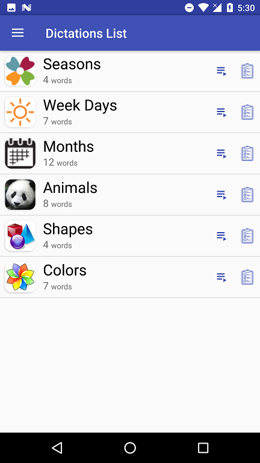
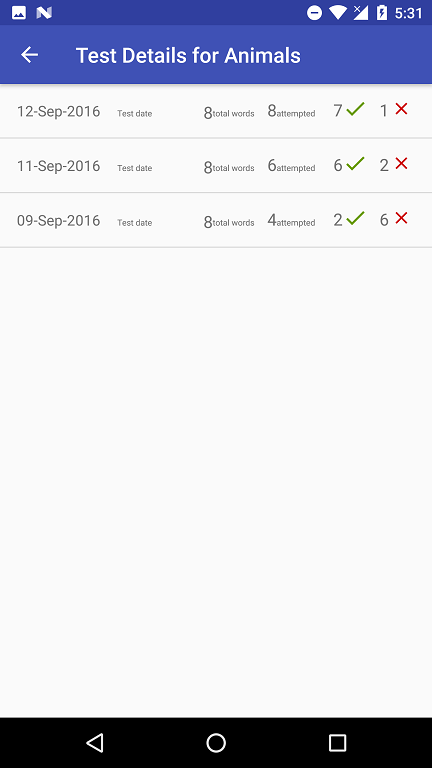
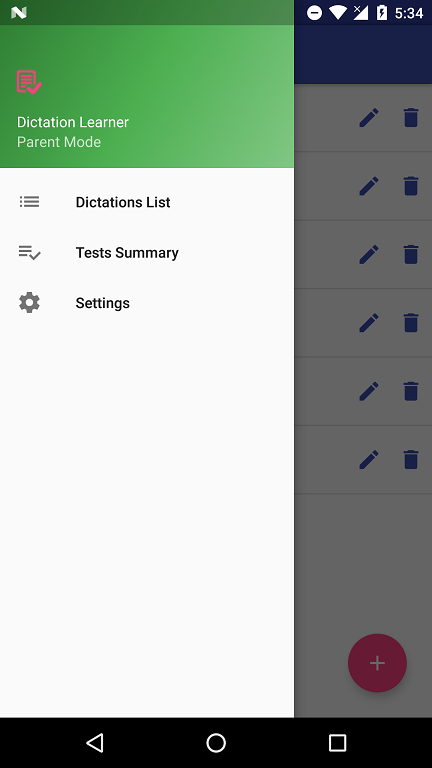

This project contains source code related to Capstone project of Udacity Android Nanodegree course. 

This application will help kids to practice and learn English words. Typically, this is required when the teacher in schools teach a set of words to students and students are required to learn them and attend a test on these words. The parents have to sit with them to teach the words. This application will enable the parents to enter the words by associating with a picture and let kids practice it, take tests until they learn all these words. The pronunciation feature available with this application will let kids learn how to pronounce it. 

Kids can practice these words using their mobile/tablet. They will help them relate to the word sounds and picture of the word. This will also improve their keyboard familiarity at early age. This will be fun and engaging for kids while learning. 

This app is for students and especially kids of early ages and those who want to participate in spell bee competitions. 

Features:
1.	Supports parent and child mode
2.	Parent mode allows to create dictation lists 
3.	Words could be added with optional picture.
4.	Child mode allows kids to practice and take tests
5.	Test results are displayed along with best score of the student for each dictation list
6.	The test history of each dictation along with which words are correct are shown

The demo video is available below 

Demo Video is available under demo folder. (demo/Video.mp4)

Here are screenshots of the application. 

